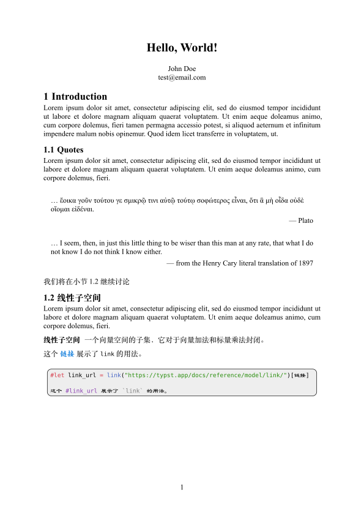

# simple-typst-note

## Example


## Usage 

```rust
#import "lib.typ": *

#let title = "Hello, World!"
#let author = (
  name: "John Doe",
  email: "test@email.com"
)
#let bib = bibliography("refer.bib")

#show: note.with(
  title: [#title],
  author: author,
  bib:bib,
  lang: "zh", 
  toc: false,
)

= Introduction

#lorem(50)

```

## Requirements

- Install `Family Song` for better font effect. You can visit [Keldos-Li/typora-latex-theme-fonts](https://github.com/Keldos-Li/typora-latex-theme-fonts/tree/main) for more infomation. 

## Advices

- VSCode + [tynymist-typst](https://marketplace.visualstudio.com/items?itemName=myriad-dreamin.tinymist) is recommended for writing typst notes.